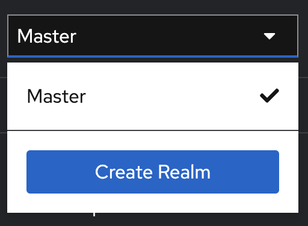
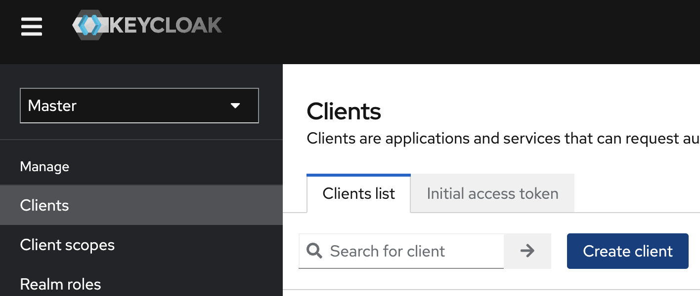
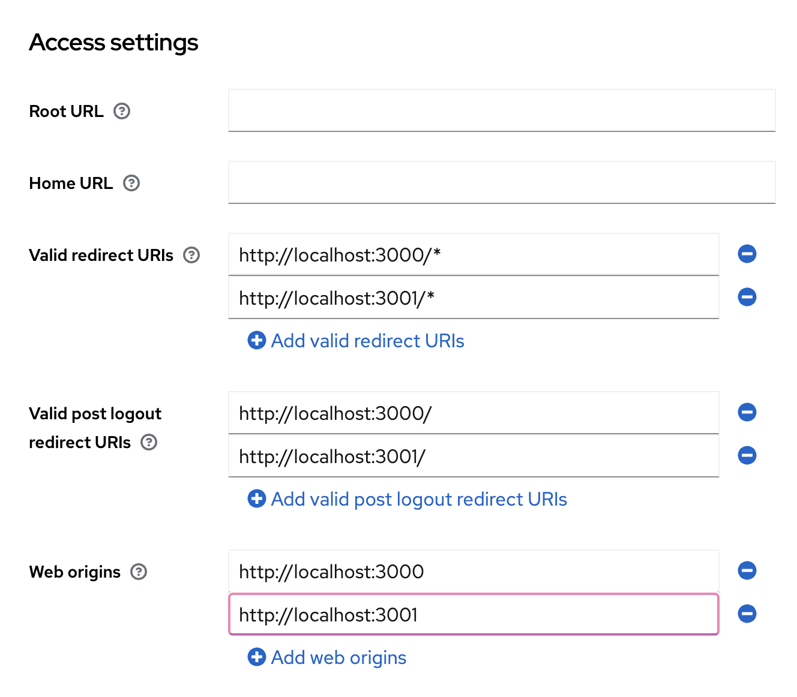

# Oliveo Discount
Monorepo for the school projet Oliveo Discount. 

## Run the Project

To run all containers:

```bash
docker compose up --build
```

Now, you need to add a Realms in the Keycloak container (if you want to go on fronts):

- Create a `docker-compose.override.yaml` file with this informations:
    ```yaml
        store-front:
            environment:
                - KEYCLOAK_URL=
                - KEYCLOAK_CLIENT=
                - KEYCLOAK_REALM=
                - CATALOG_API_URL=//localhost:3500/api

        suppliers-front:
            environment:
                - KEYCLOAK_URL=
                - KEYCLOAK_CLIENT=
                - KEYCLOAK_REALM=
                - CATALOG_API_URL=//localhost:3500/api
    ```
- Open keycloak at [localhost:8080](http://localhost:8080)
- Create a Realm



- Next, create a client


.png)
.png)

- Then, go to the client created and add configuration : 



You have to change env variables in the `docker-compose.override.yaml`. Set `KEYCLOAK_URL` with `localhost:3000/auth/`. Set `KEYCLOAK_CLIENT` with the client's name you gave and same for the `KEYCLOAK_REALM` variable.

If you want to allow registering of users, you have to go `Realm Settings` then to `login` and check the `User Registration` switch button.

To get access to the Supplier Portal, you have got ot `Realm Roles`, create a role which name will be `supplier` and apply to users you want to be suppliers. To assign a role, you have to go to `Users` Tab, then select a user and click on `Role Mapping`, `Assign role` and select `supplier`role. 

## Develop API 

You can find the documentation in the appropriate folder (in a `README.md` file).

## Tips

If the project doesn't work well:
- Remove images like `Keycloak` or `Front` images.